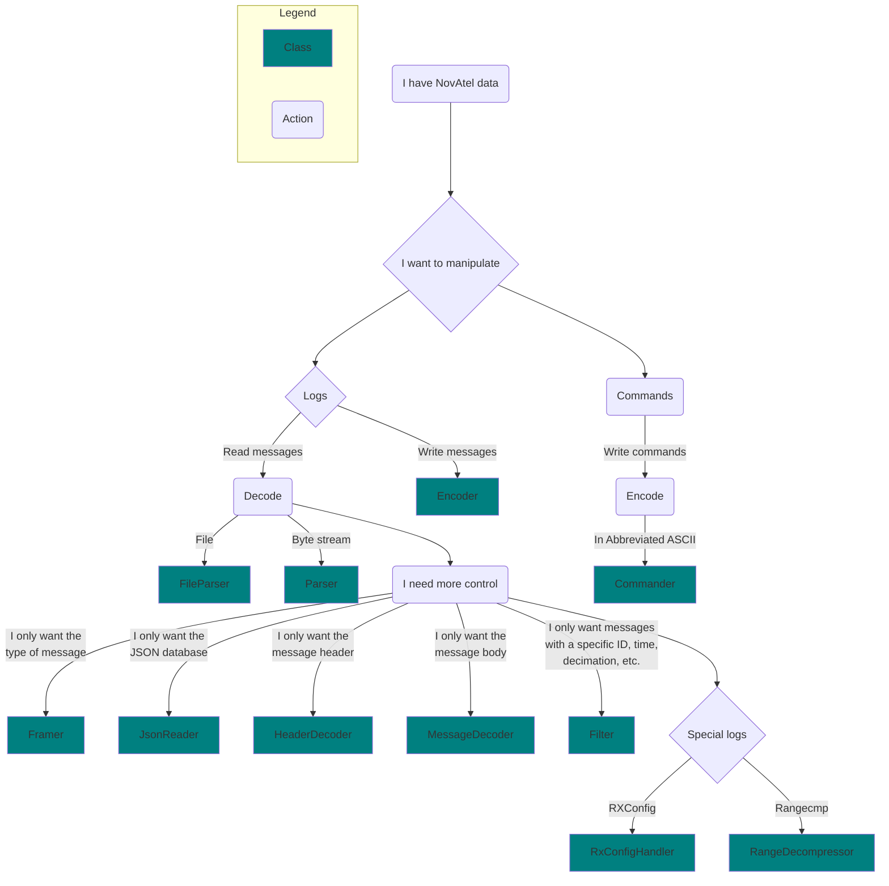

# novatel_edie

novatel_edie is a Python package for interfacing with EDIE. EDIE (Encode Decode Interface Engine) is a C++ SDK that can
encode and decode messages from NovAtel's OEM7 receivers from one format into another. This package uses the compiled 
binaries from EDIE and wraps them in a Python interface.

## Installation

Use the [pip](https://pip.pypa.io/en/stable/) package manager to install novatel_edie. Run this command:

```bash
pip install novatel_edie
```

## Usage

novatel_edie provides different classes for interfacing with messages at different levels of the decoder stack. More 
details are provided in the EDIE C++ repository but are summarized in the flowchart below.



## Examples

Below are examples on how to use EDIE's three main classes: FileParser, Parser, and Commander. 
More examples are provided in the [examples](examples) folder.

### FileParser

The FileParser class provides a specific interface for parsing GPS files.

```python
from novatel_edie.decoders import novatel as edie, common as edie_common

# Create a FileParser object for the input file and output messages in flattened binary for programmatic field access.
fp = edie.FileParser(input_file=r'C:\datasets\DATASET.GPS', encode_format=edie_common.ENCODEFORMAT.FLATTENED_BINARY)

# Only get BESTPOS messages with a FINESTEERING time status.
fp.filter.include_message_name('BESTPOS')
fp.filter.include_time_status(edie_common.TIME_STATUS.FINESTEERING)

# Iterate over all NovAtel messages in the input file.
for status, meta_data, message_data, message in fp:
    if status == edie_common.STATUS.SUCCESS:
        # With a successfully decoded BESTPOS message, access its members.
        lat = message.body.latitude
        lng = message.body.longitude
        hgt = message.body.orthometric_height
        print(lat, lng, hgt)
```

### Parser

The Parser class provides a general interface for parsing any bytes written into it such as from a file stream, serial,
Ethernet, or USB.

```python
from novatel_edie.decoders import novatel as edie, common as edie_common

# Create a Parser object and output messages in abbreviated ASCII for readability.
p = edie.Parser(encode_format=edie_common.ENCODEFORMAT.ABBREV_ASCII)

# Filter for select messages.
p.filter.include_message_name('VERSION')
p.filter.include_message_name('RXCONFIG')
p.filter.include_message_name('INSCONFIG')

# Read the contents of the byte stream into the Parser object.
with open(r'C:\datasets\DATASET.GPS', 'rb') as data_source:
    p.write(data_source.read())

# Iterate over all NovAtel messages in the input file.
for status, meta_data, message_data, message in p:
    if status == edie_common.STATUS.SUCCESS:
        print(message_data.message.decode()) # Decode bytes to ASCII.
```

### Commander

The Commander class provides an interface to convert Abbreviated ASCII commands into an equivalent ASCII or Binary 
command. Note that all fields must be provided in the abbreviated ASCII string command including optional fields.

```python
from novatel_edie.decoders import novatel as edie, common as edie_common

# Create a Commander object and output commands in full ASCII for readability and receiver response verbosity.
c = edie.Commander(encode_format=edie_common.ENCODEFORMAT.ASCII)

# Write the encoded command to an output file.
with open(f'COMMANDS.{c.encode_format.name}.GPS', 'wb') as output_file:
    # Abbreviated ASCII commands must supply all fields.
    status, encoded_message = c.encode(f'LOG BESTPOSA ONTIME 1 0 0 NOHOLD')
    if status == edie_common.STATUS.SUCCESS:
        output_file.write(encoded_message)
```

### Lower-level Components

novatel_edie also provides a number of lower-level classes to frame, decode, and encode NovAtel messages. 
Using them together provides the same functionality as the Parser, but with more detail into the intermediate states 
of the decoded message.

```python
from novatel_edie.decoders import novatel as edie, common as edie_common, jsonreader as edie_json

# Setup low-level EDIE components
fr = edie.Framer()
jr = edie_json.JsonReader()          # NOTE: A filepath could be used however, we will avoid opening this file for each component that uses it and pass an object.
hd = edie.HeaderDecoder(json_db=jr)
md = edie.MessageDecoder(json_db=jr)
e = edie.Encoder(json_db=jr, encode_format=edie_common.ENCODEFORMAT.ASCII)

# Set up a filter.
fl = edie.Filter()
fl.include_message_name('RANGE')
fl.include_time_status(edie_common.TIME_STATUS.FINESTEERING)

# Write the file contents into the Framer object.
with open(r'C:\datasets\DATASET.GPS', 'rb') as input_file:
    fr.write(input_file.read())

# Iterate over the framer. It will find valid NovAtel messages in the data written into it.
for f_status, frame, meta_data in fr:
    # NOTE: Each component can return many STATUS enums so each one should be handled accordingly.
    if f_status != edie_common.STATUS.SUCCESS:
        continue

    # A NovAtel message was found and framed. Now decode the header.
    hd_status, int_hdr = hd.decode(frame, meta_data)
    if hd_status != edie_common.STATUS.SUCCESS or not fl.filter(meta_data):
        continue

    # The header was successfully decoded and the metadata passed the filter. Now decode the message contents.
    msg_body = frame[meta_data.header_length:]
    md_status, int_msg = md.decode(msg_body, meta_data)
    if md_status != edie_common.STATUS.SUCCESS:
        continue

    # The message has been fully decoded, now reassemble into the specified format.
    e_status, message_data, message_struct = e.encode(int_hdr, int_msg, meta_data)
    if e_status == edie_common.STATUS.SUCCESS:
         print(message_data.message)
```

## Detailed Description

### Database-Centric

EDIE dynamically decodes messages. It does not retain any knowledge of the NovAtel message database within its source code.
Rather, it uses a JSON message definitions database produced from 
[nov_tools_firmware](https://gitlab.corp.novatel.ca/toolsautomation/pythonpackages/tools/nov_tools_firmware) to decode 
messages dynamically.

JSON databases can be tailored to the user's discretion and can be generated for any firmware version.
See [nov_tools_firmware](https://gitlab.corp.novatel.ca/toolsautomation/pythonpackages/tools/nov_tools_firmware) for 
more information on database generation.

### Message Fields

EDIE can decode a message into many formats. For instance, to access message fields programmatically, use the 
FLATTENED_BINARY enumeration of common.ENCODE_FORMAT.

When FLATTENED_BINARY is used, EDIE will output dynamically generated message objects. These message objects are 
instances of [c_types](https://docs.python.org/3/library/ctypes.html) structures that represent the message and its fields.

To ease development, a user can run `edie-generate-structures` to produce msg_structures.py, a file containing all the 
message definitions as Python [c_types](https://docs.python.org/3/library/ctypes.html) structures.

```bash
edie-generate-structures novatel_edie/resources/messages_public.json
```

#### Example of a BESTPOS message structure

Each item in the \_fields\_ member of the message structure is a member that can be accessed as an attribute. 
For example: BESTPOS_42_52666.latitude would provide the third element in the BESTPOS_42_52666.\_fields\_ attribute.

```python
class BESTPOS_42_52666(Structure, BaseStructMixin):
    _pack_ = 1
    _fields_ = [
        ('solution_status', c_long),
        ('position_type', c_long),
        ('latitude', c_double),
        ('longitude', c_double),
        ('orthometric_height', c_double),
        ('undulation', c_float),
        ('datum_id', c_long),
        ('latitude_std_dev', c_float),
        ('longitude_std_dev', c_float),
        ('height_std_dev', c_float),
        ('base_id', c_ubyte_Array_4),
        ('diff_age', c_float),
        ('solution_age', c_float),
        ('num_svs', c_ubyte),
        ('num_soln_svs', c_ubyte),
        ('num_soln_L1_svs', c_ubyte),
        ('num_soln_multi_svs', c_ubyte),
        ('extended_solution_status2', c_ubyte),
        ('ext_sol_stat', c_ubyte),
        ('gal_and_bds_mask', c_ubyte),
        ('gps_and_glo_mask', c_ubyte),
    ]
```

### Returned Values & Structures

#### Status Codes

EDIE components all return a standard error code:
```python
STATUS.SUCCESS                  # Successfully found a frame in the framer buffer.
STATUS.FAILURE                  # An unexpected failure occurred.
STATUS.UNKNOWN                  # Could not identify bytes as a protocol.
STATUS.INCOMPLETE               # It is possible that a valid frame exists in the frame buffer, but more information is needed.
STATUS.NULL_PROVIDED            # A null pointer was provided.
STATUS.NO_DATABASE              # No database has been provided to the component.
STATUS.NO_DEFINITION            # No definition could be found in the database for the provided message.
STATUS.NO_DEFINITION_EMBEDDED   # No definition could be found in the database for the embedded message in the RXCONFIG message.
STATUS.BUFFER_FULL              # The provided destination buffer is not big enough to contain the frame.
STATUS.BUFFER_EMPTY             # The internal circular buffer does not contain any unread bytes
STATUS.STREAM_EMPTY             # The input stream is empty.
STATUS.UNSUPPORTED              # An attempted operation is unsupported by this component.
STATUS.MALFORMED_INPUT          # The input is recognizeable, but has unexpected formatting.
STATUS.DECOMPRESSION_FAILURE    # The RANGECMPx message could not be decompressed.
```

#### MetaDataStruct

The MetaDataStruct is a [c_types](https://docs.python.org/3/library/ctypes.html) structure containing information about
the message that pertains to the message before it was decoded, or information about the message that is constant:

```python
MetaDataStruct.format               # The format of the message when it was framed.
MetaDataStruct.measurement_source   # Otherwise known as the sibling ID.
MetaDataStruct.time_status          # The GPSTimeStatus of the message.
MetaDataStruct.response             # True if this message a response to a command.
MetaDataStruct.week                 # The GPS Week No.
MetaDataStruct.milliseconds         # The GPS Milliseconds.
MetaDataStruct.binary_msg_length    # The length of the message according to the binary header (0 if format is non-binary).
MetaDataStruct.length               # The length of the message when it was framed.
MetaDataStruct.header_length        # The length of the message header when it was framed.
MetaDataStruct.message_id           # The message ID.
MetaDataStruct.message_crc          # The message definition CRC (distinguish between two versions of one message).
MetaDataStruct.message_name         # The message name.
```

#### MessageDataStruct

The MessageDataStruct is a [c_types](https://docs.python.org/3/library/ctypes.html) structure that points to the encoded 
message from the EDIE component, the buffer of which is contained within the EDIE DLL (except for the Encoder).

```python
MessageDataStruct.header         # The message header byte buffer.
MessageDataStruct.header_length  # The message header length.
MessageDataStruct.body           # The message body byte buffer.
MessageDataStruct.body_length    # The message body length.
MessageDataStruct.message        # The message byte buffer.
MessageDataStruct.message_length # The message length.
```

#### Dynamic Message Structure

For components set to encode messages to FLATTENED_BINARY, a dynamically generated message structure will be returned.
It will always contain a header (OEM4BinaryHeader) and body.

The header contents:
```python
OEM4BinaryHeader.sync_1         # Sync byte 1.
OEM4BinaryHeader.sync_2         # Sync byte 2.
OEM4BinaryHeader.sync_3         # Sync byte 3.
OEM4BinaryHeader.header_length  # The binary header length.
OEM4BinaryHeader.id             # The message ID.
OEM4BinaryHeader.type           # The type of message.
OEM4BinaryHeader.port           # The source port of the message.
OEM4BinaryHeader.length         # The length of the message.
OEM4BinaryHeader.sequence       # The sequence number of the message.
OEM4BinaryHeader.idle           # The idle time of the receiver when the message was produced.
OEM4BinaryHeader.time_status    # The GPSTimeStatus of the receiver when the message was produced.
OEM4BinaryHeader.week           # The GPS Week No when the message was produced.
OEM4BinaryHeader.milliseconds   # The GPS Milliseconds when the message was produced.
OEM4BinaryHeader.status         # The receiver status when the message was produced.
OEM4BinaryHeader.def_crc        # The message definition CRC.
OEM4BinaryHeader.rx_sw_version  # The reciver software version.
```

For information on the message body contents, see the section above - "Message Fields"
